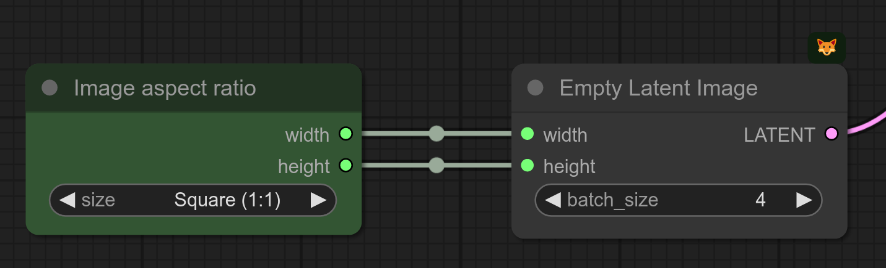

# Comfy-SelectImageSize

## Description

Custom [ComfyUI](https://github.com/comfyanonymous/ComfyUI) node for quick image size/aspect ratio selection

## Installation

1. Install [ComfyUI](https://github.com/comfyanonymous/ComfyUI)
2. git clone in the ```custom_nodes``` folder inside your ComfyUI installation or download as zip and unzip the contents to ```custom_nodes/compfyUI_Image_Size_Selector```.
3. Start/restart ComfyUI

## Usage Example

The simpliest usage is to use this node with an Empty Latent Image like in the following screenshot.


